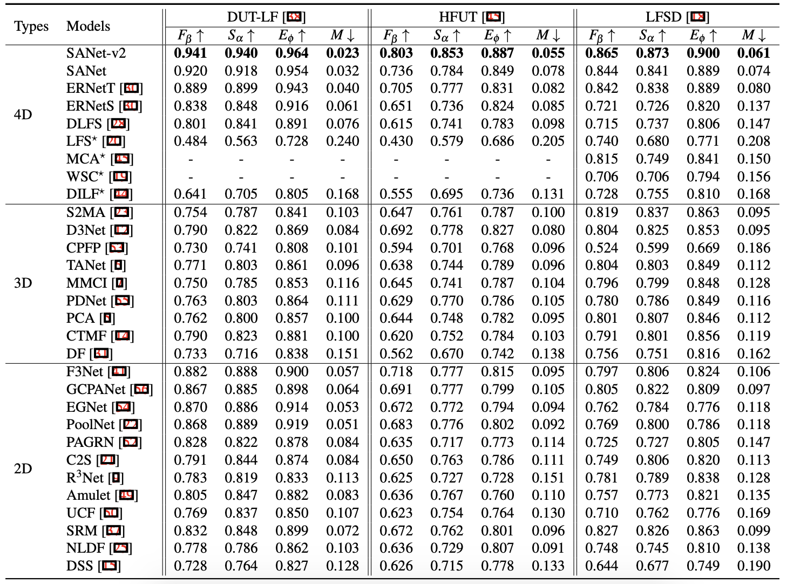

# SA-Net Version 2

------

# Introduction

In this work, we further improve the [SA-Net](https://github.com/PanoAsh/SA-Net) from the following aspects: 
 - We replace the ResNet blocks with hybrid-ViT based [transformer blocks](https://github.com/isl-org/DPT) at the AiF branch of the encoder.
 - We take advantage of the inter-slice features in both the encoding and decoding processes. Specifically, we discard the three 3D conv layers (with color gray in the figure1 of [SA-Net](https://github.com/PanoAsh/SA-Net)) at the FS branch of the encoder, and replace the original receptive field blocks (RFBs) with 3D RFBs. To fuse the 3D FS-based features and 2D AiF features at high-level, we further design a multi-head synergistic attention module (please refer to [codes](https://github.com/PanoAsh/SA-Net-v2/blob/main/models/NewBase_VIT.py)).

As a result, our SA-Net-v2 outperforms the original version of SA-Net by a large margin.

:running: :running: :running: ***KEEP UPDATING***.

------

# Results

      
    <em> 
    Figure 1: Quantitative results for different models on three benchmark datasets. The best scores are in boldface. We train and test our SA-Net-v2 with the settings that are consistent with ERNet, which is the state-of-the-art model at present. ⋆ indicates tradition methods. - denotes no available result. ↑ indicates the higher the score the better, and vice versa for ↓.
    </em>

------

# Predictions

Download the saliency prediction maps at [Google Drive](https://drive.google.com/file/d/1ft2HNDPEDAGf9R0jMZ2Hvw4Ty41dTNVX/view?usp=sharing).

------

# Inference

Download the pretrained model at [Google Drive](https://drive.google.com/file/d/1mEw6Ln3cS7X88IwaMkixZqTIoOGxGG72/view?usp=sharing).

------

# Contact 

Please feel free to drop an e-mail to yi.zhang1@insa-rennes.fr for any questions. 

